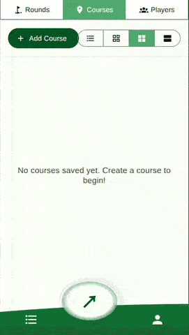

# Gulfer

A simple offline scorecard app for golf and disc-golf.
View it live at [https://modularizer.github.io/Gulfer/](https://modularizer.github.io/Gulfer/)

## Overview
Gulfer is meant to **minimize time spent on your phone at the course** at the course. 



* **Anonymous:** no login, no account, no emails, no ads, no internet
* **Offline:** play in the wilderness!
* **Fully Free:** no account needed, no premium features, no limits
* **Fast:** add scores for the hole in <5 seconds: with one tap and hit one digit per player (if you score over a 9, we'll be nice and keep it at 9)
* **Simple:** no social media, no infinite stats, no reviews
* **Concise:** see the full scorecard for the round all on one screen, minimizing clicks and screen time
* **Multiplayer:** not eveyone needs to record the game. one person can take charge and record for everyone, then export the round for friends to import into their apps
* **Built for Memories:** store photos and notes for each player, round, and course, if you wish
* **Personal Stats:** See personal bests and averages on each hole, see the avg and best stats for everyone you have played with
* **Open-Source:** Like coding? Take this project and run with it. It is free to use as you please.
* **App-Ready:** While I haven't published on Google Play or App Store yet, it is cross-platform React Native, and pretty much ready to be built into an app


## Development Setup

### Prerequisites
- Node.js (v18+)
- npm or yarn
- Expo CLI
- Android Studio (for Android development)

### Installation

```bash
npm install
```

### Running the App

```bash
# Start Expo development server
npm start

# Run on specific platform
npm run android
npm run ios
npm run web
```

## License

Unlicense: free to use as you wish

